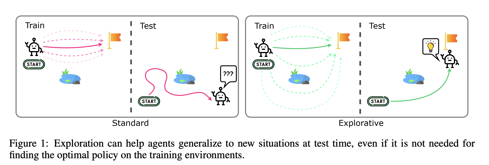
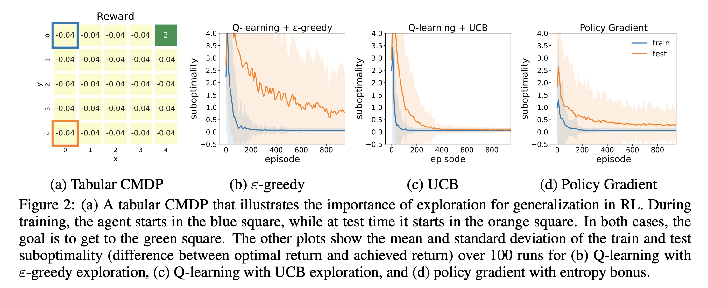
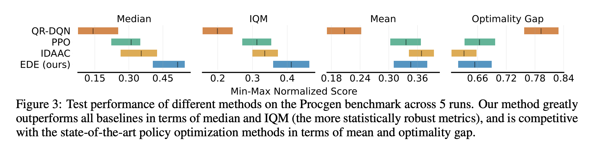
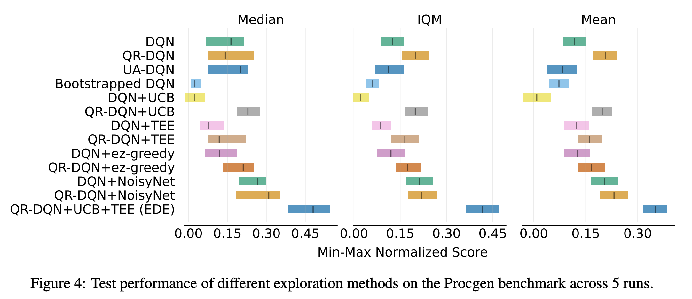

# EDE: Exploration via Distributional Ensemble

This is a PyTorch implementation of the methods proposed in

[**Uncertainty-Driven Exploration for Generalization in Reinforcement Learning**](https://openreview.net/pdf?id=nulUqBMpBb) by 

Yiding Jiang, Zico Kolter, and Roberta Raileanu.

In this work, we find that exploration is crucial for generalization to new task instances and propose the first value-based method that achieves state-of-the-art performance on both Procgen and Crafter. Our algorithm encourages the exploration of states with high epistemic
uncertainty, which is estimated using deep ensembles and distributional RL. 




## Requirements
```
conda create -n level-replay python=3.8
conda activate level-replay

git clone https://github.com/facebookresearch/level-replay.git
cd level-replay
pip install -r requirements.txt

# Clone a level-replay-compatible version of OpenAI Baselines.
git clone https://github.com/minqi/baselines.git
cd baselines 
python setup.py install
cd ..

# Clone level-replay-compatible versions of the Procgen environment.
git clone https://github.com/minqi/procgen.git
cd procgen 
python setup.py install
cd ..

git clone https://github.com/facebookresearch/ede.git
cd ede
pip install -r requirements.txt
```

## Train EDE on Procgen

```
python train_rainbow.py \\
    --algo=rainbow \\
    --env_name=bigfish \\
    --qrdqn=True \\
    --qrdqn_bootstrap=True \\
    --n_ensemble=5 \\
    --ucb_c=30 \\
    --diff_epsilon_schedule=True \\
    --diff_eps_schedule_base=0.6 \\
    --diff_eps_schedule_exp=7
```
These flags are respective:
- `n_ensemble`: number of ensemble members used for estimating the uncertainty ($M$ in the paper)
- `ucb_c`: the base exploration coefficient ($\varphi$ in the paper)
- `diff_epsilon_schedule`: use *temporally equalized exploration* (TEE)
- `diff_eps_schedule_base`: the base value for TEE ($\lambda$ in the paper)
- `diff_eps_schedule_exp`: the power value for TEE ($\alpha$ in the paper)


### Train base QR-DQN / DQN
```
python train_rainbow.py \\
    --algo=rainbow \\
    --env_name=bigfish \\
    --qrdqn=True \\
    --qrdqn_bootstrap=True
```
- `qrdqn`: `True` means the model will use QR-DQN; otherwise, non-distributional DQN will be used
- `qrdqn_bootstrap`: `True` means UCB with epistemic uncertainty is used and `False` means we are running the plain QR-DQN

### Train ez-greedy exploration
```
python train_rainbow.py \\
    --algo=rainbow \\
    --env_name=bigfish \\
    --qrdqn=True \\
    --eps_z=True \\
    --eps_z_n=10000 \\
    --eps_z_mu=2
```
- `qrdqn`: `True` means the model will use QR-DQN; otherwise, non-distributional DQN will be used
- `eps_z`: `True` means using ez-greedy
- `eps_z_n`: maximum number of steps that an action can be repeated for (maximum support of the epsilon-z greedy steps)
- `eps_z_mu`: numer that contains the "tailed-ness" of the zeta distribution

### Train NosiyNet
```
python train_rainbow.py \\
    --algo=rainbow \\
    --env_name=bigfish \\
    --qrdqn=True \\
    --noisy_layers=True
```
- `qrdqn`: `True` means the model will use QR-DQN; otherwise, non-distributional DQN will be used
- `noisy_layers`: `True` means using NoisyLayer for exploration

## Train EDE on Crafter
```
cd crafter

python main_qrdqn.py \\
    --algorithm qrdqn \\
    --explore_strat thompson \\
    --bootstrapped_qrdqn True \\
    --ucb_c 0.5 \\
    --qrdqn_always_train_feat False \\
    --T-max 1500000 \\
    --batch-size 64
```
- `explore_strat`: can be either `thompson` for Thompson sampling or `ucb` for upper-confidence bound
- `ucb_c`: exploration coefficient ($\varphi$ in the paper)
- `qrdqn_always_train_feat`: `False` means only gradient from one random ensemble member is used to train the feature extractor; otherwise, all ensemble members are used to train the feature extractor


## Tabular Experiments



## Procgen Results
**EDE** achieves state-of-the-art performance on both the Procgen and the Crafter benchmark, improving both train and test performances. This is the first value-based method to achieve SOTA on both of these benchmarks for generalization in RL. 




## Ablations



## Crafter Results


## Acknowledgements
This code was based on open sourced implementations of [PLR](https://github.com/facebookresearch/level-replay), [QR-DQN](https://github.com/andyehrenberg/dqn-procgen), [Procgen](https://github.com/openai/procgen), and [Crafter](https://github.com/danijar/crafter).

Figures in this work are made with assets from FlatIcon:
- <a href="https://www.flaticon.com/free-icons/idea" title="idea icons">Idea icons created by Good Ware - Flaticon</a>
- <a href="https://www.flaticon.com/free-icons/robot" title="robot icons">Robot icons created by Creative Stall Premium - Flaticon</a>
- <a href="https://www.flaticon.com/free-icons/pond" title="pond icons">Pond icons created by Mihimihi - Flaticon</a>
- <a href="https://www.flaticon.com/free-icons/flag" title="flag icons">Flag icons created by Us and Up - Flaticon</a>
- <a href="https://www.flaticon.com/free-icons/start" title="start icons">Start icons created by Freepik - Flaticon</a>

## Citation
If you use this code in your own work, please cite our paper:
```
@inproceedings{
anonymous2023uncertaintydriven,
title={Uncertainty-Driven Exploration for Generalization in Reinforcement Learning},
author={Anonymous},
booktitle={Submitted to The Eleventh International Conference on Learning Representations },
year={2023},
url={https://openreview.net/forum?id=nulUqBMpBb},
note={under review}
}
```

## License
The majority of this repository is licensed under CC-BY-NC 4.0 (Creative Commons Attribution-NonCommercial 4.0 International License). However, portions of this code are available under separate license terms e.g. Procgen and Crafter are licensed under the MIT license.
